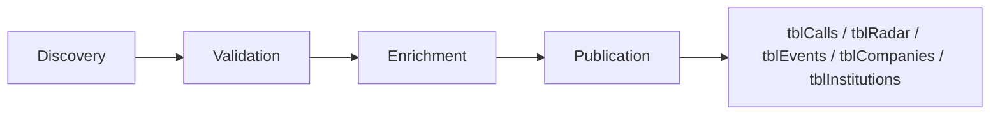

# SFIP Scheduled Pipeline

Este documento resume as quatro tarefas agendadas que consomem o `source_manifest.json`.

## Fluxo Geral

## 1. Discovery

| Campo | Definição |
|---|---|
| Quando executa | Diariamente às 05:00 Europe/Lisbon |
| Fontes consultadas | Todas as fontes do manifesto |
| Lê | `catalog`, `source_manifest`, `raw source snapshots` |
| Escreve | `raw_snapshots`, `discovery_queue`, `change_log` |
| Para quando | fonte indisponível, sem alteração detetada, ou falta metadados obrigatórios |
| Envia para revisão humana | mudança de layout, código/data ambígua, conteúdo misto entre call e radar |

## 2. Validation

| Campo | Definição |
|---|---|
| Quando executa | Diariamente às 06:00 Europe/Lisbon |
| Fontes consultadas | `discovery_queue`, `raw_snapshots`, `source_manifest` |
| Lê | filas de descoberta e snapshots brutos |
| Escreve | `validation_queue`, `staging_calls`, `staging_radar`, `staging_events`, `validation_log` |
| Para quando | falha de schema, duplicado confirmado, ou valor não suportado pela fonte |
| Envia para revisão humana | financiamento inferido, deadline inferido, fontes em conflito, confiança baixa |

## 3. Enrichment

| Campo | Definição |
|---|---|
| Quando executa | Diariamente às 06:30 Europe/Lisbon |
| Fontes consultadas | `staging_calls`, `staging_radar`, `tblInvestigadores`, `tblMatching`, `tblRadar` |
| Lê | registos validados e base interna de perfis/matching |
| Escreve | `enriched_calls`, `enriched_radar`, `enriched_events`, `enriched_companies`, `enrichment_log` |
| Para quando | não há itens validados, referência interna indisponível, ou score abaixo do mínimo |
| Envia para revisão humana | matching apenas indicativo, audiência incompleta, empates de relevância |

## 4. Publication

| Campo | Definição |
|---|---|
| Quando executa | Diariamente às 07:00 Europe/Lisbon e on-demand após aprovação |
| Fontes consultadas | `enriched_calls`, `enriched_radar`, `enriched_events`, `enriched_companies`, `approval_queue` |
| Lê | itens enriquecidos e aprovações pendentes |
| Escreve | `tblCalls`, `tblRadar`, `tblEvents`, `tblCompanies`, `tblInstitutions`, `tblMatching`, `tblSourceSnapshots`, `tblChangeLog` |
| Para quando | aprovação humana pendente, duplicado não resolvido, ou tabela de destino indisponível |
| Envia para revisão humana | qualquer item com aprovação obrigatória, confiança baixa, transição radar→call, ou conflito de duplicados |

## Regras comuns

1. O `Discovery` nunca escreve diretamente em tabelas finais.
2. O `Validation` nunca publica itens sem esquema e coerência temporal válidos.
3. O `Enrichment` nunca inventa investigadores, grupos ou prioridades.
4. O `Publication` só promove itens após validação e, quando exigido, aprovação humana.
5. Todos os itens relevantes devem manter histórico em `tblSourceSnapshots` e `tblChangeLog`.

